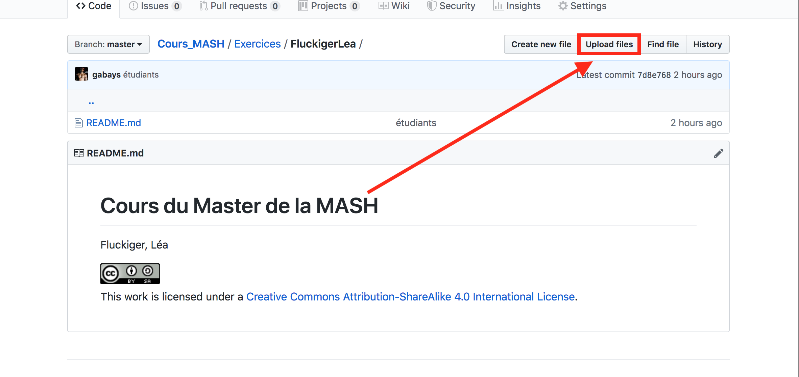
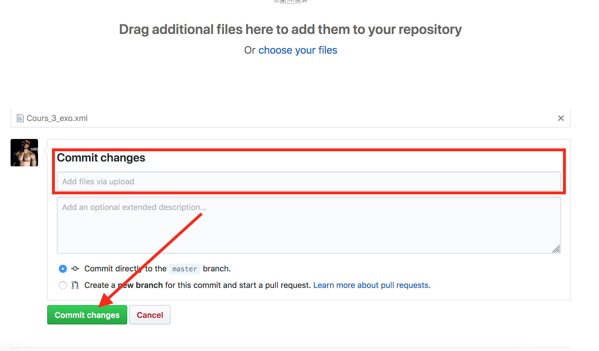

# Mettre en ligne les exercices

* Allez sur le dossier à votre nom

* Cliquez sur ```upload``` (cf. image _infra_)



* Glissez le fichier à uploader en suivant cette convention de nommage: ```NomPrenom_exo1.xml``` (adaptez le chiffre)

* Renseignez le champ ```Commit changes``` en ajoutant un petit message sur ce que vous faites (par exemple: “ajout du premier exercice”) dans le premier champ (laissez second libre).

* Laissez cochée la case ```commit direct to the master branch```

* Cliquez ```Commit changes.```




<a rel="license" href="http://creativecommons.org/licenses/by-sa/4.0/"></a><br />This work is licensed under a <a rel="license" href="http://creativecommons.org/licenses/by-sa/4.0/">Creative Commons Attribution-ShareAlike 4.0 International License</a>.


